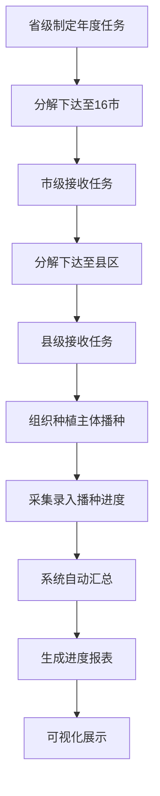
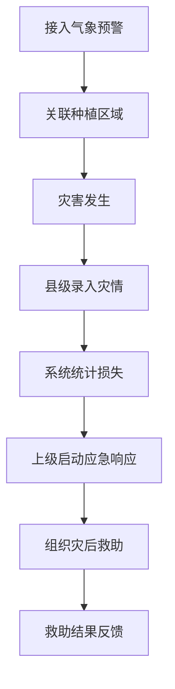
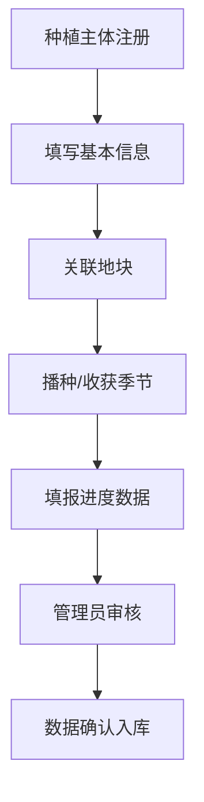

# 粮食计划管理系统 - 产品需求文档

## 1. 产品概述

粮食计划管理系统是一个面向省、市、县三级农业管理部门的综合性粮食生产管理平台，实现从播种任务分解、进度调度、统计分析到防灾减灾的全流程数字化管理。系统支持到户、到田的精细化管理，为粮食安全提供数据支撑和决策支持。

**核心价值**：
- 实现粮食生产全流程数字化管理，提升管理效率
- 支持到户到田的精细化数据采集，确保数据准确性
- 提供可视化一张图展示，辅助科学决策
- 建立防灾减灾应急机制，降低灾害损失

## 2. 核心功能

### 2.1 用户角色

| 角色 | 注册方式 | 核心权限 |
|------|----------|----------|
| 省级管理员 | 系统分配 | 全省数据查看、任务分解下达、统计分析、防灾减灾指挥 |
| 市级管理员 | 系统分配 | 本市数据查看、任务分解下达、进度调度、数据上报 |
| 县级管理员 | 系统分配 | 本县数据查看、进度采集录入、种植主体管理、数据上报 |
| 种植主体 | 自主注册 | 个人信息维护、地块关联、进度填报 |

### 2.2 功能模块

#### 2.2.1 种植主体管理
- **主体信息维护**：规模大户、家庭农场、合作社、普通农户等主体信息管理
- **地块关联**：支持主体与具体地块的关联管理
- **信息查询**：按地区、类型、规模等条件查询主体信息

#### 2.2.2 种植计划及调度
- **任务分解**：省级对16市年度播种面积分解，市级分解下达至县区
- **播种进度调度**：每日统计各地已播种面积、任务完成度
- **收获进度调度**：每日统计各地已收获面积、收获完成度

#### 2.2.3 种植计划落实
- **播种进度采集**：分地区、分作物播种进度录入，自动计算进度
- **收获进度采集**：分地区、分作物收获进度录入，自动计算进度
- **明细数据管理**：支持到户、到田的明细数据录入

#### 2.2.4 种植统计分析
- **数据汇总**：各市、县年度播种面积、产量情况汇总
- **报表生成**：自动生成分析报表，支持导出

#### 2.2.5 防灾减灾
- **防灾减灾调度**：灾前应急、受灾情况、灾后救助管理
- **防灾减灾统计**：灾害数据统计分析
- **气象预警**：气象预警信息接入与展示

#### 2.2.6 一张图展示
- **粮食生产一张图**：行政区划播种面积任务展示、进度动态可视化、详情钻取
- **防灾减灾指挥一张图**：风险预警上图、灾情态势图

### 2.3 页面详情

| 页面名称 | 模块名称 | 功能描述 |
|---------|---------|---------|
| 首页 | 数据概览 | 全省粮食生产关键指标展示、进度概览、预警提醒 |
| 首页 | 快捷入口 | 各功能模块快捷访问入口 |
| 种植主体管理 | 主体列表 | 种植主体信息列表展示、查询、筛选 |
| 种植主体管理 | 主体详情 | 主体详细信息查看、编辑、地块关联管理 |
| 种植主体管理 | 地块管理 | 地块信息维护、地图标注、面积测量 |
| 任务分解 | 任务列表 | 年度播种面积任务列表、分解情况展示 |
| 任务分解 | 任务分解 | 省级对市级、市级对县级任务分解下达 |
| 任务分解 | 任务详情 | 任务详细信息查看、进度跟踪 |
| 播种进度 | 进度总览 | 各地区播种进度汇总展示、进度条可视化 |
| 播种进度 | 进度采集 | 分地区、分作物播种进度数据录入 |
| 播种进度 | 明细查询 | 到户、到田的播种明细数据查询 |
| 收获进度 | 进度总览 | 各地区收获进度汇总展示、进度条可视化 |
| 收获进度 | 进度采集 | 分地区、分作物收获进度数据录入 |
| 收获进度 | 明细查询 | 到户、到田的收获明细数据查询 |
| 统计分析 | 数据汇总 | 各市、县年度播种面积、产量数据汇总 |
| 统计分析 | 报表生成 | 自动生成分析报表、支持导出Excel/PDF |
| 统计分析 | 图表展示 | 柱状图、折线图、饼图等多种图表展示 |
| 防灾减灾 | 预警信息 | 气象预警、病虫害预警信息展示 |
| 防灾减灾 | 灾情管理 | 灾害发生记录、受灾情况登记、灾后救助 |
| 防灾减灾 | 统计分析 | 灾害数据统计分析、损失评估 |
| 粮食生产一张图 | 地图展示 | 行政区划播种面积任务可视化展示 |
| 粮食生产一张图 | 进度可视化 | 动态进度条展示播种、收获完成度 |
| 粮食生产一张图 | 详情钻取 | 点击区域下钻查看任务分解、进度明细 |
| 防灾减灾一张图 | 风险预警 | 气象预警与耕地底图叠加显示 |
| 防灾减灾一张图 | 灾情态势 | 受灾区域标绘、灾情分布展示 |
| 惠农政策 | 政策列表 | 补贴政策文件列表展示 |
| 惠农政策 | 政策详情 | 政策文件查看、解读说明 |

## 3. 核心流程

### 3.1 任务分解与进度调度流程

省级管理员制定年度播种面积任务，分解下达至16个市；市级管理员接收任务后，进一步分解下达至所辖县区；县级管理员组织种植主体进行播种，并定期采集录入播种进度数据；系统自动汇总各级进度数据，生成进度报表和可视化图表。

### 3.2 防灾减灾调度流程

系统接入气象预警信息，自动关联种植区域；灾害发生后，县级管理员录入灾情信息；系统自动统计受灾面积、损失评估；上级部门根据灾情启动应急响应，组织灾后救助。

### 3.3 种植主体管理流程

种植主体自主注册或管理员录入基本信息；主体关联具体地块；在播种/收获季节，主体填报进度数据；管理员审核确认数据。

## 4. 用户界面设计

### 4.1 设计风格

**主题色彩**：
- 主色调：深绿色 (#059669) - 代表农业、生态
- 辅助色：金黄色 (#F59E0B) - 代表丰收、粮食
- 背景色：浅灰白 (#F9FAFB) - 清爽、专业
- 强调色：蓝色 (#3B82F6) - 用于链接、按钮

**按钮风格**：
- 主要按钮：圆角矩形，深绿色背景，白色文字
- 次要按钮：圆角矩形，白色背景，深绿色边框和文字
- 危险按钮：圆角矩形，红色背景，白色文字

**字体规范**：
- 标题字体：思源黑体 / Noto Sans SC，加粗
- 正文字体：思源黑体 / Noto Sans SC，常规
- 字号：大标题 24px，中标题 18px，小标题 16px，正文 14px，辅助文字 12px

**布局风格**：
- 顶部导航栏 + 左侧菜单栏 + 右侧内容区
- 卡片式布局，圆角 8px
- 响应式设计，支持桌面端和移动端

**图标风格**：
- 使用 Lucide React 图标库
- 线性图标，线条粗细 2px
- 与文字颜色保持一致

### 4.2 页面设计概览

| 页面名称 | 模块名称 | UI元素 |
|---------|---------|--------|
| 首页 | 数据概览 | 4个数据卡片（播种面积、收获面积、任务完成率、预警数量），绿色渐变背景，数字大号显示 |
| 首页 | 进度概览 | 进度条组件，显示播种和收获进度，动态填充效果 |
| 首页 | 预警提醒 | 警告卡片列表，红色/橙色/黄色标识不同级别预警 |
| 种植主体管理 | 主体列表 | 表格布局，支持筛选、搜索、排序，每行显示主体名称、类型、规模、联系方式 |
| 种植主体管理 | 主体详情 | 左侧基本信息卡片，右侧地块列表，地图展示地块位置 |
| 任务分解 | 任务列表 | 树形结构展示省-市-县三级任务分解情况，进度条显示完成度 |
| 任务分解 | 任务分解 | 表单布局，左侧选择下级区域，右侧输入分解面积，自动计算剩余面积 |
| 播种进度 | 进度总览 | 地图组件 + 右侧数据面板，地图上显示各地区进度，点击可查看详情 |
| 播种进度 | 进度采集 | 表单布局，选择地区、作物类型，输入已播面积，自动计算进度百分比 |
| 统计分析 | 数据汇总 | 表格 + 图表组合，上方筛选条件，左侧数据表格，右侧图表展示 |
| 统计分析 | 报表生成 | 报表预览区域，支持导出按钮（Excel、PDF） |
| 防灾减灾 | 预警信息 | 时间轴布局，按时间倒序展示预警信息，不同颜色标识预警级别 |
| 防灾减灾 | 灾情管理 | 表单布局，录入灾害类型、发生时间、地点、受灾面积等信息 |
| 粮食生产一张图 | 地图展示 | 全屏地图，行政区划边界清晰，区域内显示任务面积和进度条 |
| 粮食生产一张图 | 详情钻取 | 弹窗/侧边栏展示区域详情，包含任务分解、进度明细、主要种植主体 |
| 防灾减灾一张图 | 风险预警 | 地图叠加预警区域，不同颜色标识风险等级，图例说明 |
| 防灾减灾一张图 | 灾情态势 | 地图标绘受灾区域，显示灾情种类、分布、影响程度 |

### 4.3 响应式设计

- **桌面优先**：主要面向办公场景，优先适配桌面端（1920x1080、1366x768）
- **移动适配**：支持平板和手机访问，关键功能可在移动端操作
- **触摸优化**：移动端按钮和链接尺寸适配触摸操作，最小点击区域 44x44px

### 4.4 交互设计

**进度可视化**：
- 进度条动态填充动画，从0%到当前进度
- 进度低于50%显示红色，50%-80%显示橙色，80%以上显示绿色
- 鼠标悬停显示详细数据

**地图交互**：
- 支持缩放、平移
- 点击区域下钻查看详情
- 鼠标悬停显示区域基本信息

**数据录入**：
- 表单实时校验，错误提示即时显示
- 支持批量导入Excel数据
- 自动保存草稿功能

**通知提醒**：
- 系统通知：任务下达、进度预警、灾害预警等
- 消息中心：集中展示所有通知消息
- 支持短信、邮件通知（可选配置）
