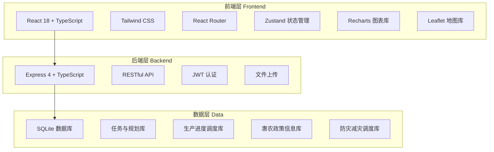
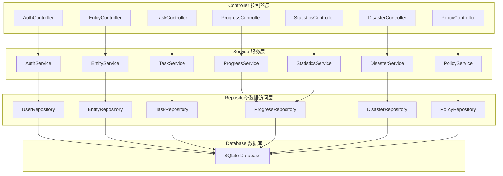
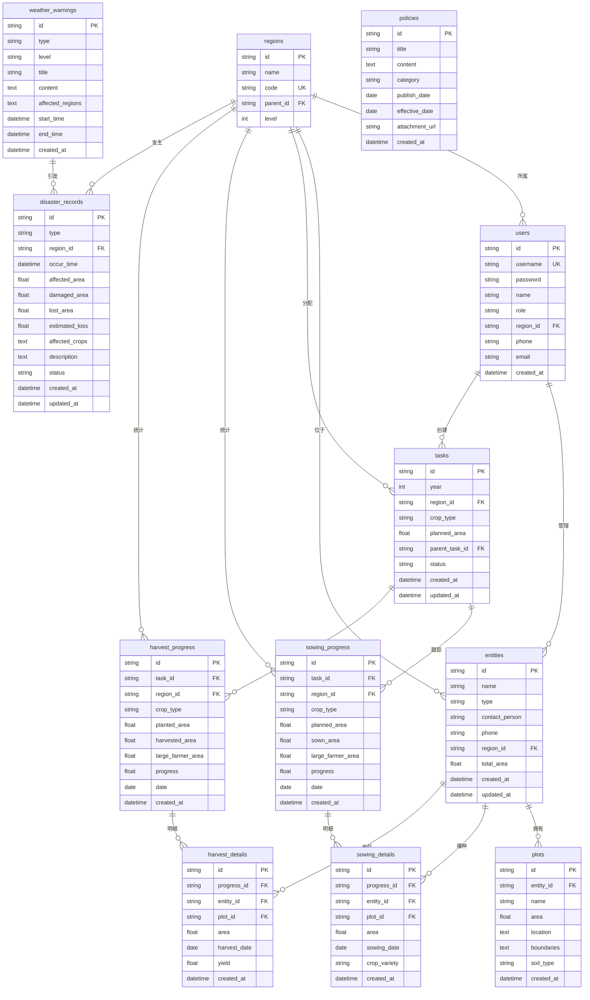

# 粮食计划管理系统 - 技术架构文档

## 1. 架构设计

系统采用前后端分离的架构模式，前端使用React + TypeScript构建单页应用，后端使用Express + TypeScript提供RESTful API服务，数据库使用SQLite进行数据存储。



## 2. 技术栈说明

### 2.1 前端技术栈
- **框架**: React 18 + TypeScript
- **构建工具**: Vite
- **样式方案**: Tailwind CSS 3
- **路由管理**: React Router DOM 6
- **状态管理**: Zustand
- **图表库**: Recharts（用于统计图表）
- **地图库**: Leaflet + React-Leaflet（用于一张图展示）
- **图标库**: Lucide React
- **工具库**: date-fns（日期处理）、xlsx（Excel导入导出）

### 2.2 后端技术栈
- **框架**: Express 4 + TypeScript
- **数据库**: SQLite（better-sqlite3）
- **认证**: JWT (jsonwebtoken)
- **密码加密**: bcryptjs
- **文件上传**: multer
- **数据验证**: zod
- **跨域**: cors

### 2.3 开发工具
- **包管理器**: pnpm
- **代码规范**: ESLint + Prettier
- **类型检查**: TypeScript

## 3. 路由定义

### 3.1 前端路由

| 路由路径 | 页面名称 | 功能描述 |
|---------|---------|---------|
| `/` | 首页 | 数据概览、快捷入口 |
| `/login` | 登录页 | 用户登录 |
| `/entities` | 种植主体管理 | 主体列表、详情、地块管理 |
| `/entities/:id` | 主体详情 | 查看和编辑主体信息 |
| `/tasks` | 任务分解 | 任务列表、分解下达 |
| `/tasks/:id` | 任务详情 | 查看任务详情和进度 |
| `/sowing` | 播种进度 | 进度总览、采集、明细 |
| `/harvest` | 收获进度 | 进度总览、采集、明细 |
| `/statistics` | 统计分析 | 数据汇总、报表生成 |
| `/disaster` | 防灾减灾 | 预警信息、灾情管理 |
| `/map/production` | 粮食生产一张图 | 地图可视化展示 |
| `/map/disaster` | 防灾减灾一张图 | 灾情态势地图 |
| `/policies` | 惠农政策 | 政策列表、详情 |

### 3.2 后端API路由

| 路由路径 | 方法 | 功能描述 |
|---------|------|---------|
| **认证相关** |
| `/api/auth/login` | POST | 用户登录 |
| `/api/auth/logout` | POST | 用户登出 |
| `/api/auth/profile` | GET | 获取当前用户信息 |
| **种植主体管理** |
| `/api/entities` | GET | 获取主体列表 |
| `/api/entities/:id` | GET | 获取主体详情 |
| `/api/entities` | POST | 创建主体 |
| `/api/entities/:id` | PUT | 更新主体 |
| `/api/entities/:id` | DELETE | 删除主体 |
| `/api/plots` | GET | 获取地块列表 |
| `/api/plots/:id` | GET | 获取地块详情 |
| `/api/plots` | POST | 创建地块 |
| `/api/plots/:id` | PUT | 更新地块 |
| **任务分解** |
| `/api/tasks` | GET | 获取任务列表 |
| `/api/tasks/:id` | GET | 获取任务详情 |
| `/api/tasks` | POST | 创建任务 |
| `/api/tasks/:id` | PUT | 更新任务 |
| `/api/tasks/:id/decompose` | POST | 分解任务 |
| **播种进度** |
| `/api/sowing/progress` | GET | 获取播种进度汇总 |
| `/api/sowing/details` | GET | 获取播种明细 |
| `/api/sowing/record` | POST | 录入播种进度 |
| **收获进度** |
| `/api/harvest/progress` | GET | 获取收获进度汇总 |
| `/api/harvest/details` | GET | 获取收获明细 |
| `/api/harvest/record` | POST | 录入收获进度 |
| **统计分析** |
| `/api/statistics/summary` | GET | 获取数据汇总 |
| `/api/statistics/report` | GET | 生成报表 |
| `/api/statistics/export` | GET | 导出报表 |
| **防灾减灾** |
| `/api/disaster/warnings` | GET | 获取预警信息 |
| `/api/disaster/records` | GET | 获取灾情记录 |
| `/api/disaster/records` | POST | 录入灾情 |
| `/api/disaster/records/:id` | PUT | 更新灾情 |
| **惠农政策** |
| `/api/policies` | GET | 获取政策列表 |
| `/api/policies/:id` | GET | 获取政策详情 |
| `/api/policies` | POST | 发布政策 |
| **行政区划** |
| `/api/regions` | GET | 获取行政区划树 |
| `/api/regions/:id` | GET | 获取区域详情 |

## 4. API数据结构定义

### 4.1 通用响应格式

```typescript
interface ApiResponse<T> {
  success: boolean;
  data?: T;
  message?: string;
  error?: string;
}
```

### 4.2 核心数据类型

```typescript
// 用户角色
type UserRole = 'province_admin' | 'city_admin' | 'county_admin' | 'farmer';

// 用户信息
interface User {
  id: string;
  username: string;
  name: string;
  role: UserRole;
  regionId: string;
  phone?: string;
  email?: string;
  createdAt: string;
}

// 种植主体类型
type EntityType = 'large_farmer' | 'family_farm' | 'cooperative' | 'small_farmer';

// 种植主体
interface Entity {
  id: string;
  name: string;
  type: EntityType;
  contactPerson: string;
  phone: string;
  regionId: string;
  totalArea: number;
  createdAt: string;
  updatedAt: string;
}

// 地块
interface Plot {
  id: string;
  entityId: string;
  name: string;
  area: number;
  location: {
    lat: number;
    lng: number;
  };
  boundaries: Array<{lat: number; lng: number}>;
  soilType?: string;
  createdAt: string;
}

// 作物类型
type CropType = 'wheat' | 'rice' | 'corn' | 'soybean' | 'other';

// 任务
interface Task {
  id: string;
  year: number;
  regionId: string;
  cropType: CropType;
  plannedArea: number;
  parentTaskId?: string;
  status: 'pending' | 'in_progress' | 'completed';
  createdAt: string;
  updatedAt: string;
}

// 播种进度
interface SowingProgress {
  id: string;
  taskId: string;
  regionId: string;
  cropType: CropType;
  plannedArea: number;
  sownArea: number;
  largeFarmerArea: number;
  progress: number;
  date: string;
  createdAt: string;
}

// 播种明细
interface SowingDetail {
  id: string;
  progressId: string;
  entityId: string;
  plotId: string;
  area: number;
  sowingDate: string;
  cropVariety?: string;
  createdAt: string;
}

// 收获进度
interface HarvestProgress {
  id: string;
  taskId: string;
  regionId: string;
  cropType: CropType;
  plantedArea: number;
  harvestedArea: number;
  largeFarmerArea: number;
  progress: number;
  date: string;
  createdAt: string;
}

// 收获明细
interface HarvestDetail {
  id: string;
  progressId: string;
  entityId: string;
  plotId: string;
  area: number;
  harvestDate: string;
  yield?: number;
  createdAt: string;
}

// 预警级别
type WarningLevel = 'red' | 'orange' | 'yellow' | 'blue';

// 预警类型
type WarningType = 'typhoon' | 'drought' | 'flood' | 'frost' | 'heatwave' | 'pest';

// 气象预警
interface WeatherWarning {
  id: string;
  type: WarningType;
  level: WarningLevel;
  title: string;
  content: string;
  affectedRegions: string[];
  startTime: string;
  endTime: string;
  createdAt: string;
}

// 灾害类型
type DisasterType = 'drought' | 'flood' | 'typhoon' | 'hail' | 'frost' | 'pest' | 'other';

// 灾情记录
interface DisasterRecord {
  id: string;
  type: DisasterType;
  regionId: string;
  occurTime: string;
  affectedArea: number;
  damagedArea: number;
  lostArea: number;
  estimatedLoss: number;
  affectedCrops: CropType[];
  description: string;
  status: 'reported' | 'verified' | 'assisted';
  createdAt: string;
  updatedAt: string;
}

// 惠农政策
interface Policy {
  id: string;
  title: string;
  content: string;
  category: string;
  publishDate: string;
  effectiveDate: string;
  attachmentUrl?: string;
  createdAt: string;
}

// 行政区划
interface Region {
  id: string;
  name: string;
  code: string;
  parentId?: string;
  level: number;
  children?: Region[];
}
```

## 5. 服务器架构图



## 6. 数据模型

### 6.1 数据模型定义



### 6.2 数据库表结构定义

```sql
-- 用户表
CREATE TABLE users (
    id TEXT PRIMARY KEY,
    username TEXT UNIQUE NOT NULL,
    password TEXT NOT NULL,
    name TEXT NOT NULL,
    role TEXT NOT NULL CHECK(role IN ('province_admin', 'city_admin', 'county_admin', 'farmer')),
    region_id TEXT,
    phone TEXT,
    email TEXT,
    created_at DATETIME DEFAULT CURRENT_TIMESTAMP,
    FOREIGN KEY (region_id) REFERENCES regions(id)
);

-- 行政区划表
CREATE TABLE regions (
    id TEXT PRIMARY KEY,
    name TEXT NOT NULL,
    code TEXT UNIQUE NOT NULL,
    parent_id TEXT,
    level INTEGER NOT NULL CHECK(level IN (1, 2, 3)),
    FOREIGN KEY (parent_id) REFERENCES regions(id)
);

-- 种植主体表
CREATE TABLE entities (
    id TEXT PRIMARY KEY,
    name TEXT NOT NULL,
    type TEXT NOT NULL CHECK(type IN ('large_farmer', 'family_farm', 'cooperative', 'small_farmer')),
    contact_person TEXT NOT NULL,
    phone TEXT NOT NULL,
    region_id TEXT NOT NULL,
    total_area REAL DEFAULT 0,
    created_at DATETIME DEFAULT CURRENT_TIMESTAMP,
    updated_at DATETIME DEFAULT CURRENT_TIMESTAMP,
    FOREIGN KEY (region_id) REFERENCES regions(id)
);

-- 地块表
CREATE TABLE plots (
    id TEXT PRIMARY KEY,
    entity_id TEXT NOT NULL,
    name TEXT NOT NULL,
    area REAL NOT NULL,
    location TEXT,
    boundaries TEXT,
    soil_type TEXT,
    created_at DATETIME DEFAULT CURRENT_TIMESTAMP,
    FOREIGN KEY (entity_id) REFERENCES entities(id)
);

-- 任务表
CREATE TABLE tasks (
    id TEXT PRIMARY KEY,
    year INTEGER NOT NULL,
    region_id TEXT NOT NULL,
    crop_type TEXT NOT NULL CHECK(crop_type IN ('wheat', 'rice', 'corn', 'soybean', 'other')),
    planned_area REAL NOT NULL,
    parent_task_id TEXT,
    status TEXT DEFAULT 'pending' CHECK(status IN ('pending', 'in_progress', 'completed')),
    created_at DATETIME DEFAULT CURRENT_TIMESTAMP,
    updated_at DATETIME DEFAULT CURRENT_TIMESTAMP,
    FOREIGN KEY (region_id) REFERENCES regions(id),
    FOREIGN KEY (parent_task_id) REFERENCES tasks(id)
);

-- 播种进度表
CREATE TABLE sowing_progress (
    id TEXT PRIMARY KEY,
    task_id TEXT NOT NULL,
    region_id TEXT NOT NULL,
    crop_type TEXT NOT NULL,
    planned_area REAL NOT NULL,
    sown_area REAL DEFAULT 0,
    large_farmer_area REAL DEFAULT 0,
    progress REAL DEFAULT 0,
    date DATE NOT NULL,
    created_at DATETIME DEFAULT CURRENT_TIMESTAMP,
    FOREIGN KEY (task_id) REFERENCES tasks(id),
    FOREIGN KEY (region_id) REFERENCES regions(id)
);

-- 播种明细表
CREATE TABLE sowing_details (
    id TEXT PRIMARY KEY,
    progress_id TEXT NOT NULL,
    entity_id TEXT NOT NULL,
    plot_id TEXT NOT NULL,
    area REAL NOT NULL,
    sowing_date DATE NOT NULL,
    crop_variety TEXT,
    created_at DATETIME DEFAULT CURRENT_TIMESTAMP,
    FOREIGN KEY (progress_id) REFERENCES sowing_progress(id),
    FOREIGN KEY (entity_id) REFERENCES entities(id),
    FOREIGN KEY (plot_id) REFERENCES plots(id)
);

-- 收获进度表
CREATE TABLE harvest_progress (
    id TEXT PRIMARY KEY,
    task_id TEXT NOT NULL,
    region_id TEXT NOT NULL,
    crop_type TEXT NOT NULL,
    planted_area REAL NOT NULL,
    harvested_area REAL DEFAULT 0,
    large_farmer_area REAL DEFAULT 0,
    progress REAL DEFAULT 0,
    date DATE NOT NULL,
    created_at DATETIME DEFAULT CURRENT_TIMESTAMP,
    FOREIGN KEY (task_id) REFERENCES tasks(id),
    FOREIGN KEY (region_id) REFERENCES regions(id)
);

-- 收获明细表
CREATE TABLE harvest_details (
    id TEXT PRIMARY KEY,
    progress_id TEXT NOT NULL,
    entity_id TEXT NOT NULL,
    plot_id TEXT NOT NULL,
    area REAL NOT NULL,
    harvest_date DATE NOT NULL,
    yield REAL,
    created_at DATETIME DEFAULT CURRENT_TIMESTAMP,
    FOREIGN KEY (progress_id) REFERENCES harvest_progress(id),
    FOREIGN KEY (entity_id) REFERENCES entities(id),
    FOREIGN KEY (plot_id) REFERENCES plots(id)
);

-- 气象预警表
CREATE TABLE weather_warnings (
    id TEXT PRIMARY KEY,
    type TEXT NOT NULL CHECK(type IN ('typhoon', 'drought', 'flood', 'frost', 'heatwave', 'pest')),
    level TEXT NOT NULL CHECK(level IN ('red', 'orange', 'yellow', 'blue')),
    title TEXT NOT NULL,
    content TEXT NOT NULL,
    affected_regions TEXT,
    start_time DATETIME NOT NULL,
    end_time DATETIME NOT NULL,
    created_at DATETIME DEFAULT CURRENT_TIMESTAMP
);

-- 灾情记录表
CREATE TABLE disaster_records (
    id TEXT PRIMARY KEY,
    type TEXT NOT NULL CHECK(type IN ('drought', 'flood', 'typhoon', 'hail', 'frost', 'pest', 'other')),
    region_id TEXT NOT NULL,
    occur_time DATETIME NOT NULL,
    affected_area REAL DEFAULT 0,
    damaged_area REAL DEFAULT 0,
    lost_area REAL DEFAULT 0,
    estimated_loss REAL DEFAULT 0,
    affected_crops TEXT,
    description TEXT,
    status TEXT DEFAULT 'reported' CHECK(status IN ('reported', 'verified', 'assisted')),
    created_at DATETIME DEFAULT CURRENT_TIMESTAMP,
    updated_at DATETIME DEFAULT CURRENT_TIMESTAMP,
    FOREIGN KEY (region_id) REFERENCES regions(id)
);

-- 惠农政策表
CREATE TABLE policies (
    id TEXT PRIMARY KEY,
    title TEXT NOT NULL,
    content TEXT NOT NULL,
    category TEXT NOT NULL,
    publish_date DATE NOT NULL,
    effective_date DATE NOT NULL,
    attachment_url TEXT,
    created_at DATETIME DEFAULT CURRENT_TIMESTAMP
);

-- 创建索引
CREATE INDEX idx_users_region ON users(region_id);
CREATE INDEX idx_entities_region ON entities(region_id);
CREATE INDEX idx_plots_entity ON plots(entity_id);
CREATE INDEX idx_tasks_region ON tasks(region_id);
CREATE INDEX idx_tasks_year ON tasks(year);
CREATE INDEX idx_sowing_progress_region ON sowing_progress(region_id);
CREATE INDEX idx_sowing_progress_date ON sowing_progress(date);
CREATE INDEX idx_harvest_progress_region ON harvest_progress(region_id);
CREATE INDEX idx_harvest_progress_date ON harvest_progress(date);
CREATE INDEX idx_disaster_records_region ON disaster_records(region_id);
CREATE INDEX idx_disaster_records_time ON disaster_records(occur_time);
```

## 7. 项目目录结构

```
liangshiv1/
├── src/                          # 前端源码
│   ├── components/               # 可复用组件
│   │   ├── common/              # 通用组件
│   │   │   ├── Button.tsx
│   │   │   ├── Card.tsx
│   │   │   ├── Table.tsx
│   │   │   ├── Form.tsx
│   │   │   ├── Modal.tsx
│   │   │   └── ProgressBar.tsx
│   │   ├── layout/              # 布局组件
│   │   │   ├── Header.tsx
│   │   │   ├── Sidebar.tsx
│   │   │   └── Layout.tsx
│   │   ├── charts/              # 图表组件
│   │   │   ├── BarChart.tsx
│   │   │   ├── LineChart.tsx
│   │   │   └── PieChart.tsx
│   │   └── map/                 # 地图组件
│   │       ├── MapView.tsx
│   │       └── RegionLayer.tsx
│   ├── pages/                   # 页面组件
│   │   ├── Home.tsx
│   │   ├── Login.tsx
│   │   ├── entities/
│   │   │   ├── EntityList.tsx
│   │   │   └── EntityDetail.tsx
│   │   ├── tasks/
│   │   │   ├── TaskList.tsx
│   │   │   └── TaskDetail.tsx
│   │   ├── progress/
│   │   │   ├── SowingProgress.tsx
│   │   │   └── HarvestProgress.tsx
│   │   ├── statistics/
│   │   │   └── Statistics.tsx
│   │   ├── disaster/
│   │   │   └── DisasterManagement.tsx
│   │   ├── map/
│   │   │   ├── ProductionMap.tsx
│   │   │   └── DisasterMap.tsx
│   │   └── policies/
│   │       └── PolicyList.tsx
│   ├── hooks/                   # 自定义Hooks
│   │   ├── useAuth.ts
│   │   ├── useApi.ts
│   │   └── useMap.ts
│   ├── store/                   # Zustand状态管理
│   │   ├── authStore.ts
│   │   ├── entityStore.ts
│   │   ├── taskStore.ts
│   │   └── progressStore.ts
│   ├── utils/                   # 工具函数
│   │   ├── api.ts
│   │   ├── format.ts
│   │   └── validation.ts
│   ├── types/                   # TypeScript类型定义
│   │   ├── index.ts
│   │   ├── entity.ts
│   │   ├── task.ts
│   │   └── progress.ts
│   ├── App.tsx                  # 根组件
│   ├── main.tsx                 # 入口文件
│   └── index.css                # 全局样式
├── api/                         # 后端源码
│   ├── controllers/             # 控制器
│   │   ├── authController.ts
│   │   ├── entityController.ts
│   │   ├── taskController.ts
│   │   ├── progressController.ts
│   │   ├── statisticsController.ts
│   │   ├── disasterController.ts
│   │   └── policyController.ts
│   ├── services/                # 服务层
│   │   ├── authService.ts
│   │   ├── entityService.ts
│   │   ├── taskService.ts
│   │   ├── progressService.ts
│   │   ├── statisticsService.ts
│   │   ├── disasterService.ts
│   │   └── policyService.ts
│   ├── repositories/            # 数据访问层
│   │   ├── userRepository.ts
│   │   ├── entityRepository.ts
│   │   ├── taskRepository.ts
│   │   ├── progressRepository.ts
│   │   ├── disasterRepository.ts
│   │   └── policyRepository.ts
│   ├── middleware/              # 中间件
│   │   ├── auth.ts
│   │   ├── errorHandler.ts
│   │   └── validator.ts
│   ├── routes/                  # 路由定义
│   │   ├── authRoutes.ts
│   │   ├── entityRoutes.ts
│   │   ├── taskRoutes.ts
│   │   ├── progressRoutes.ts
│   │   ├── statisticsRoutes.ts
│   │   ├── disasterRoutes.ts
│   │   └── policyRoutes.ts
│   ├── database/                # 数据库相关
│   │   ├── init.ts
│   │   ├── seed.ts
│   │   └── migrations/
│   ├── types/                   # TypeScript类型定义
│   │   └── index.ts
│   ├── app.ts                   # Express应用配置
│   └── server.ts                # 服务器入口
├── shared/                      # 前后端共享类型
│   └── types.ts
├── migrations/                  # 数据库迁移文件
├── public/                      # 静态资源
├── package.json
├── tsconfig.json
├── vite.config.ts
├── tailwind.config.js
└── postcss.config.js
```

## 8. 开发计划

### 8.1 第一阶段：基础框架搭建
- 初始化项目环境
- 配置前后端基础架构
- 实现用户认证功能
- 创建基础布局组件

### 8.2 第二阶段：核心功能开发
- 实现种植主体管理模块
- 实现任务分解模块
- 实现播种/收获进度管理模块
- 实现统计分析模块

### 8.3 第三阶段：高级功能开发
- 实现防灾减灾模块
- 实现粮食生产一张图
- 实现防灾减灾一张图
- 实现惠农政策管理

### 8.4 第四阶段：优化与测试
- 性能优化
- 功能测试
- 用户体验优化
- 文档完善
